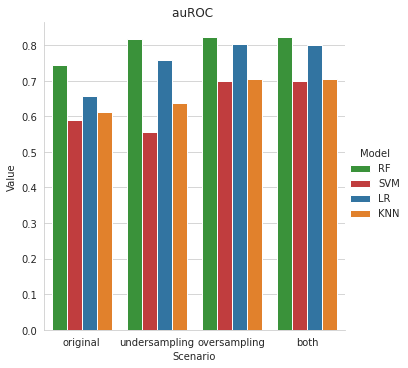
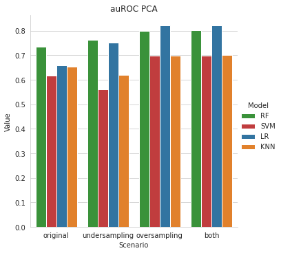

# Online_Shoppers_Intention
Project aiming to predict transactions from a customer on an e-commerce platform. Please load the pickle files *results_without_PCA.pkl* and *results_with_PCA.pkl* if would like to reproduce the results obtained.

## Dataset
The analysis is based on the public avaiable [UCI dataset](https://archive.ics.uci.edu/ml/datasets/Online+Shoppers+Purchasing+Intention+Dataset). The collection is
made up of 18 feature vectors (10 numerical and 8 categorical) and 12, 330 different samples. Each of
them would be owned by a different user throughout the course of a year to prevent any inclination to a
certain cause, holiday, or user period, or profile.

## Resampling techniques
The class label *Revenue* is imbalanced so different resampling techniques has been used in order to find which one could achieve best final results and 4 different scenarios were simulated:

* **Original**: no resampling technique was adopted.
* **Undersampling**: NearMiss algorithm v3 ([paper](https://www.site.uottawa.ca/~nat/Workshop2003/jzhang.pdf))
* **Oversampling**: SMOTE
* **Both** (oversampling + undersampling): SMOTE + TomekLinks

## Results
Below are reported the auROCs for each scenario and classifier with and without PCA, if interested in other metrics please have a look in final_final_project_MML_3

